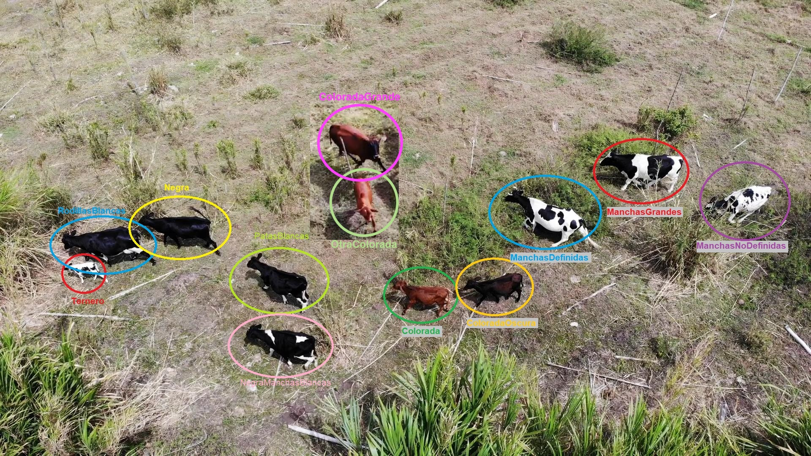

# ABOUT THE DATASET

As you can see on this folder, we have 2 folders: dataset_by_student and Pool, both contains the same number of images and the same number of targets. but they have different distributions and are splitted in different ways.

| Target        | Observations           |
| ------------- |:-------------:| 
| ManchasNoDefinidas    | its spots are smoller and more  distributed|
| ManchasGrandes   | It is the cow which has the biggest spots|
|ManchasDefiniidas| Its spots are bigger and more centralized |
|ColoradaOscura | Its skin is brown dark|
|PatasBlancas | it skin is completely black except its legs|
|NegraManchasBlancas |it is black, with white legs besides of white spots in back and nape |
|Negra | it is the darkest cow|
|RodillasBlancas |it is black but has a white fringe in its legs additionally the most part of time it is with cow "Ternero"|
|Ternero |It’s the smallest cow, also Ternero is frequently close to RodillasBlancas across the dataset.|
|Colorada |
|ColoradaGrande |its skin is so similar to ‘Colorada’ the difference is ‘ColoradaGrande’ is bigger than ‘Colorada’
|OtraColorada |It’s a little bit confuse to see the difference between Colorada and OtraColorada, but OtraColorada is slightly lightlier.|

 **Observation:** 
 
 It is necessary to clarify that the difference between OtraColorada and Colorada are so difficult to detect if the image was taken from far away. So, what we did in those cases was make a tracking with the another images to detect is the instance it was Colorada or OtraColorada, unfortunately, it wasn’t possilbe in all cases, then we was sure to not repeat the label in those especific cases where the tracking was impossible.

### dataset_by_labeller

| Student | Percentage | Number of images | Targeted File|
|---------|------------|------------------|--------------|
|Anderson Jimenez|6.87%|139|targets.json|
|Camila Castrillon|6.87%|139|targets.json
|Emanuel Alzate|6.87%|139|targets.json
|Jose Miguel H|6.87%|139|targets.json
|Juan Diego Cardona|6.87%|139|targets.json
|Juan José Gdo|6.87%|139|targets.json
|Mario Perez|6.72%|136|targets.json
|Miguel Aristizabal|6.87%|139|targets.json
|Santiago Sanchez|6.87%|139|targets.json
|vacas_sololoco|3.95%|80|labels.json
|Wbeimar Agudelo|6.87%|139|targets.json
|Cristian Camilo|6.87%|139|targets.json
|Juan Jose Gdo D2|6.87%|139|targets.json
|Reinel Castrillon|6.87%|139|targets.json
|Sebastian Ramirez|6.87%|139
|TOTAL|100%|2023|-----------|

### Pool

|POOL|Percentage|Number of images|Targeted File|
|----|----------|----------------|-------------|
|Test| 15%|193|all_tables_test.json
|Train|76.44%|1006|all_tables_train.json
|Validation|8.5%|112|all_tables_val.json
|----------|100%|1311|----------|

## About targets.json

The targets.json are the files where are all the information about the labels, the coordinates of the mask, the image to which those labels and coordinates correspond etc. In summary these files contain all the information of the dataset (by labeller and pool). 

